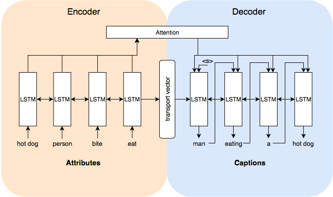

# NL Generation from structured inputs

Authors: Tatjana Chernenko, Kim Almasan, Siting Liang, Bente Nittka 12th June, 2018

Natural Language Generation using structured input. 
Generating descriptions from textual attributes.


| Resource                                           | Link                                                                                         |
|----------------------------------------------------|----------------------------------------------------------------------------------------------|
| **Demo**                                           | [Demo Notebook](https://github.com/TatjanaChernenko/image_description_generation/blob/main/Demo.ipynb)    |
| **Project Specification**                          | [Specification Report](https://github.com/TatjanaChernenko/image_description_generation/blob/main/docs/NL_generation_Specification_report.pdf)   |
| **Resulting Paper**                                | [Paper on NL Generation](https://github.com/TatjanaChernenko/image_description_generation/blob/main/docs/Paper_NL_generation.pdf)   |
| **Presentation**                                   | [Project Presentation](https://github.com/TatjanaChernenko/image_description_generation/blob/main/docs/NL_generation__Praesentation.pdf)   |
| **Models & Hyperparameters**                       | [Models and Hyperparameters](https://github.com/TatjanaChernenko/image_description_generation/blob/main/docs/NL_generation_Models.xlsx)    |


# Problem Definition
The recent significant improvements in *generating natural language 
descriptions of images* and easily available image-sentence data sets make 
the computer vision and natural language processing communities to 
engage in inventing more efficient joint models, which require both 
computer vision and natural language processing techniques. 
Automatic image description generation is a problem which involves vision 
recognition in order to detect objects, substances, and locations. 
As the *textual descriptions* from data sets usually supply the spatial 
relations between the objects and provide the attributes for describing 
them, we aim to explore the impact of the features extracted from the 
textual descriptions and attributes and to create a model that ultimately 
generates a textual description that verbalizes the detected aspects 
of the image.

# Approach and Implementation
This project aims to generate descriptions of images focusing on spatial relationships between the objects and sufficient attributes for the objects. 
We consider only the images with 2-5 objects in one image 
(see Dataset for more details). 
As an orientation for our architecture we take *Dong et al. (2017)* who 
generate product reviews from attributes, a task that is 
similar in structure to ours.
The whole system has an encoder-decoder architecture. 
The feed-forward neural network encoder reads the normalized 
vector representations of all the attributes as input. 
The model transforms this into a rich fixed-length vector 
representation which in turn is used as the initial hidden state of a 
decoder that consists of several LSTMs. LSTMs take the words from the sequences from the description sentences as input and generate the target sentence.By infer- ence we are going to evaluate the performance of the usage of the BeamSearch and Sampling methods.


This project **focuses on generating natural language descriptions for images by exploring the relationship between textual descriptions and image attributes**. Leveraging an encoder-decoder architecture with LSTM cells, the system transforms normalized vector representations of attributes into fixed-length vectors. These vectors serve as initial states for a decoder generating target sentences from sequences in description sentences.

The project evolves in stages, starting with the MS COCO dataset and incrementally incorporating attributes from V-COCO and COCO-a datasets. These datasets provide object labels, descriptions, action labels, semantic roles, spatial relations, and additional attributes for people and objects within images. The goal is to incrementally enhance the model's descriptive capabilities by introducing diverse attributes and evaluating the system's performance at each stage.

The evaluation involves automatic metrics like BLEU, METEOR, CIDEr, semantic similarity, and grammar-based measures along with human evaluations. The system's development, comparison against baselines, and enhancements are tracked using GitLab. The project employs TensorFlow, PlaidML, and Keras for the machine learning framework, integrating NLTK for evaluation and comparison purposes.

### Please find more information about the apporach, architecture and research results in [doc](https://github.com/TatjanaChernenko/image_description_generation/tree/main/docs) folder.

# Requirements

* Python 3.6
* Linux / macOS

# Usage for Development

1. Install pipenv `pip3 install pipenv`
2. Install all depencies `pipenv install --dev`
3. Enter virtual enviornment `pipenv shell`


# Clone the repository:
```
git clone https://gitlab.com/cl-swp/swp-project
```

# Run data set download & preprocessing

* `python start.py`

The preprocessed data can be found in the directory `assets/prepared_data/`

## Programm Usage

```
usage: start.py [-h] (--id ID | --name NAME) (--train | --infer | --decode_attr)
                [--no-preprocess]

optional arguments:
  -h, --help            show this help message and exit
  --id ID               select model by id (starting at 0)
  --name NAME           select model by name
  --train               do training
  --infer               do inference, which needs a text file as input and save the output in a text file
  --decode_attr         decode attributes from one image, which only needs a string of input and generate standard output
  --no-preprocess, -np  disable dataset preprocessing
```


# Loading preprocessed data

```
from persistance import Binary
file_content = Binary.load(path_to_file)
```

# Prepare train and evaluation data for models, to train a model we will have to generate train.attr,train.capt, dev.attr,dev.capt,test.attr,test.capt,vocab.attr,vocab.capt files.
*  module: write_data.py
*  important functions: write\_coco, write\_coco_a
*  'write_coco' takes two positional arguments: input path and output path
*  'write\_coco\_a' takes four positional arguments: input path, output path, path to image_id file which is generated by writing coco data set, and number of interactions
*  examples(first make ms coco data, then coco-a)

```
path_coco = "assets/prepared_data/1.1_2_3.bin"
path_coco_out = 'train_data/1.1_2_3/ms_coco_input/'
write_coco(path_coco,path_coco_out)
```
```
path_coco_a = "assets/prepared_data/1.4_5_6.bin"
path_coco_a_out = 'train_data/1.4_5_6/coco_a_input/'
image_id_file = 'train_data/1.1_2_3/ms_coco_input/image_id.txt'
write_coco_a(path_coco_a, path_coco_a_out, image_id_file, num_interaction=2)
```

# Load embeddings (glove as example) and make two embedding text file for attributes and captions:
```
wget https://nlp.stanford.edu/projects/glove/glove.840B.300d.zip
unzip glove.840B.300d.zip
cp glove.6B.300d glove.6B.300d.attr
cp glove.6B.300d glove.6B.300d.capt
```

# Encoder and Decoder Models:
### Structure


### Description
The whole system has an encoder-decoder architecture which consists of LSTM cells.
The LSTM Encoder reads the normalized vector representations of all the attributes as input.
The Encoder transforms this into a rich fixed-length vector representation which is the initial
LSTM Decoder takes the words from the sequences from the description sentences as input and generate the target sentence.

### Implementation and modules
* modelBuilder: This module initial the components for constructing the recurrent neural network models, such as embed layer, cells, gradient clip etc., as well as
                construct functions to create and load model for three different models: create_train_mode, create_infer_mode, create_eval_model, return the three model objects: TrainModel, InferModel and EvalModel

* basicModel: This module builds the basic encoder(encoder has two types: uni or bidirectional)  and decoder structure, configures the hyperparameters for train, infer and eval modes, build the mode graph, saves the global variables to the checkpoint files.
              The encoder_decoder_basic class inherits the encoder_decoder super class, implements the _build_encoder, _build_bidirectional_rnn and _build_decoder_cell functions, _build_encoder or _build_bidirectional_rnn returns the encoder_state, which will be taken by the _build_decoder_cell 
              as arguments and passed to the decoder_initial_state
             
* attentionMechanism:  There are 3 options of attention mechanisms: luong, bahdanau and normed_bahdanau, these three options can be assign by model setting in the setting.json file like: 'attention':'bahdanau'.           
    
* attentionModel: This module returns the encoder_decoder_attention class, which inherits the encoder_decoder_basic class, the encoder_outputs will be saved in memory,which can be processed by the attention_mechanism: attention_mechanism_fn(
        attention_option, num_units, memory, source_sequence_length, mode), and the decoder_initial_state can be fed with AttentionWrapper cell's zero_state and encoder_state


# Run the model with specific mode (train, inference, decode_attr):

### Modules
* train: This module imports attentionModel and basicModel, initial train, inference and evaluation steps, generate three models: 

```
train_model = modelBuilder.create_train_model(model_creator, hparams, scope)
eval_model = modelBuilder.create_eval_model(model_creator, hparams, scope)
infer_model = modelBuilder.create_infer_model(model_creator, hparams, scope)

```

* inference: This module creates two inference options, inference an input file or just an input string.

* attr2capt: The main module, which parses the hyperparameters, runs the train, inference and decode_attr functions. 

### Examples 
Run the following command to start the training with your own hyperparameters:
Save all training data in one directory, all attributes files and attribute vocabulary are expected to have the same suffix,
so as the captions files and caption vocabulary file have same suffix.
For example, there are different input data sets in the `train_data` directories: `train_data/1.1_2_3`,`train_data/1.4_5_6` etc.
The `settings.json` file in the `assets/model_setting/` directory is the configuration file for different training models with different input or model options,
for example to train a model with ms_coco attributes and without attention(since with attention is our default setting, so here we need to set the value to 'attention' to a empty str),
we should initial the setting for the training as following:
 
```
{"name": "1.1",
    "flags": {
    },
    "hparameter": {
        "out_dir": "./train_data/1.1_2_3/ms_coco_model/model_1/",
        "attention": "",
        "train_prefix": "./train_data/1.1_2_3/ms_coco_input/train",
        "dev_prefix": "./train_data/1.1_2_3/ms_coco_input/dev",
        "test_prefix": "./train_data/1.1_2_3/ms_coco_input/test",
        "vocab_prefix": "./train_data/1.1_2_3/ms_coco_input/vocab"
    }
```

So now we can start to train model '1.1' (with ms coco attributes input and without attention) :
* train model 1.1

```
python start.py --name 1.1 --train -np
```

### To run a model with glove pretrained embedding set, we need to make sure we have two text files of pretrained embeddings for both attributes and captions (e.g. glove.6B.300d.attr, glove.6B.300d.capt), then add the path of embedding files to the model setting (without file suffix):
```
{"name": "1.3",
    "flags": {
    },
    "hparameter": {
        "out_dir": "./train_data/1.1_2_3/ms_coco_model/model_3/",
        "train_prefix": "./train_data/1.1_2_3/ms_coco_input/train",
        "dev_prefix": "./train_data/1.1_2_3/ms_coco_input/dev",
        "test_prefix": "./train_data/1.1_2_3/ms_coco_input/test",
        "vocab_prefix": "./train_data/1.1_2_3/ms_coco_input/vocab",
        "embed_prefix":"./glove.6B.300d"
    }
```

* train model 1.3

```
python start.py --name 1.3 --train -np
```

### As long as we have trained a model, we obtain the checkpoints which can be restored for the inference step. For this case we should first add the path to latest checkpoints summary to the hparameters setting: 

```
{"name": "1.3",
    "flags": {
    },
    "hparameter": {
        "out_dir": "./train_data/1.1_2_3/ms_coco_model/model_3/",
        "train_prefix": "./train_data/1.1_2_3/ms_coco_input/train",
        "dev_prefix": "./train_data/1.1_2_3/ms_coco_input/dev",
        "test_prefix": "./train_data/1.1_2_3/ms_coco_input/test",
        "vocab_prefix": "./train_data/1.1_2_3/ms_coco_input/vocab",
        "embed_prefix":"./glove.6B.300d",
        "ckpt":"./train_data/1.1_2_3/ms_coco_model/model_3/translate.ckpt-15000
    }
```
### And add the path to inference_input_file to model setting after adding the path to checkpoint directory, for example we use the test.attr file for inference: 

```
'inference_input_file':'./train_data/1.1_2_3/ms_coco_input/test.attr'
```

* inference with trained model 1.3

```
python start.py --name 1.3 --inference -np
```

* decode a string attributes input (it will be asked to give a string of attributes to be decoded).

<<<<<<< HEAD
The system uses rouge and bleu scores to evaluate the model at every time step.
The code for the complete automatic evaluation of output created during the inference step can be found in the ./evaluate directory. It also contains the necessary files for human evaluation.
More information on how to run the evaluation code can be found in ./evaluate/README.md
=======
```
python start.py --name 1.3 --decode-attr -np
```
### Hands-on how to decode an input string directly (more examples in  Jupyter notebook demo `./Demo.ipynb`)

>>>>>>> 2b906956d29b9d6df2b7f05751c1b2ca9611e55e
```
from attr2capt import start_decode
model_2 = '1.2'
input_attr = input('Please give a sequence of attributes to this photo: ')
start_decode(model_2, input_attr)
```


# Visualize the training process through tensorboard:

Start a new terminal window:
```
tensorboard --port 22222 --logdir .train_data/1.1_2_3/ms_coco_model/model_2/ # path to the output direction
```


# Evaluate the results:

The system computes bleu scores to evaluate the model at every time step.
The code for the complete automatic evaluation of output produced by inference is contained in the ./evaluate directory.
It also contains the necessary files for human evaluation.
More information on how to evaluate can be found in  `./evaluate/README.md`. 


# To augment more input data with Back Translation:
```
mkdir ./train_data/augm_coco_a/augm_coco_a_input/
mkdir ./train_data/augm_coco_a/augm_coco_a_model/
```
Run Data_Augmentation_COCO.ipynb

Then run the model as usual using new directories for input and output data.
